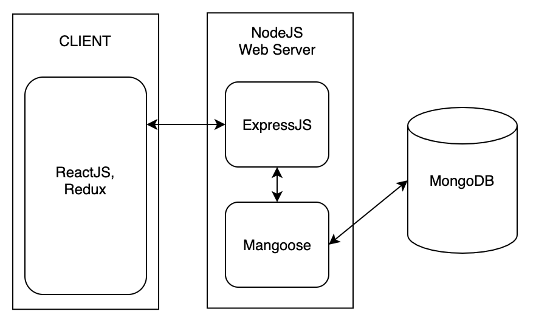
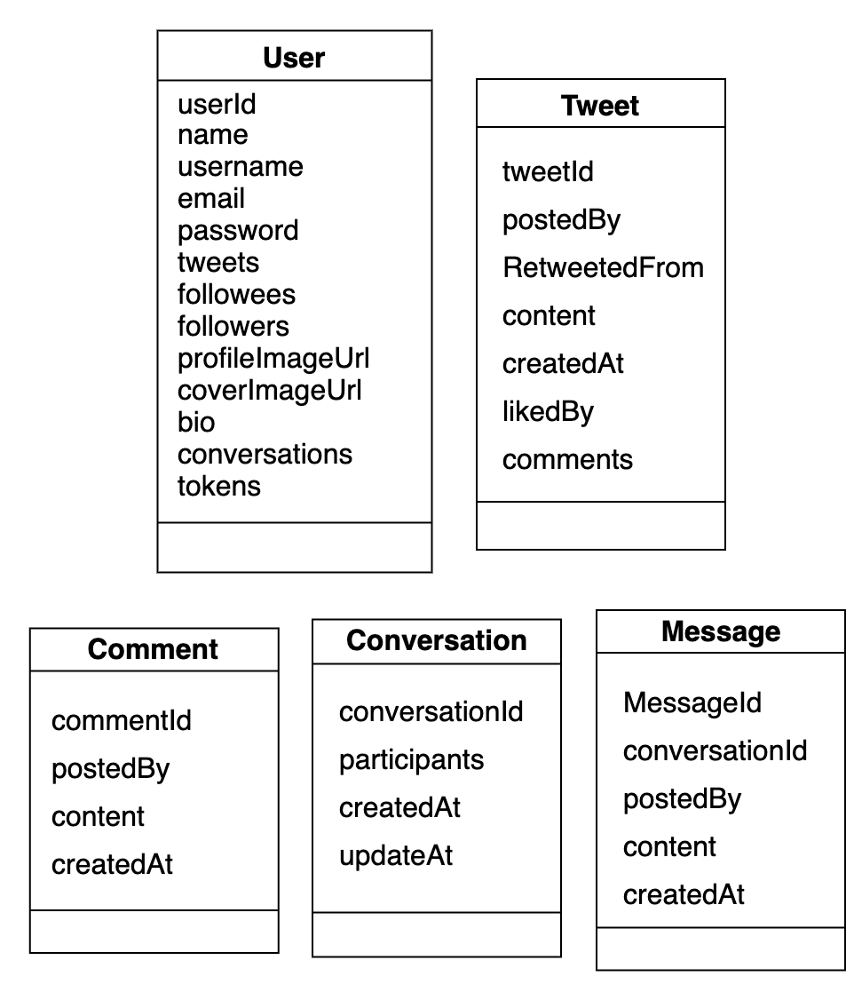

# Twitter Clone (MERN)

This is a Twitter clone built with ReactJS, Redux, Hooks, NodeJS, Express, and MongoDB (MERN).
I made this as a side-project to apply what I recently learned on the MERN stack.

Current Status:
   - server-side done
   - client-side **IN DEVELOPMENT**

---

## Table of Contents

- System Design Documentation
  - Functional and Non-functional Requirements
    - Functional requirements
    - Non-Functional requirements
  - API Endpoints
  - Database and Storage Discussion
    - Relational Database vs NoSQL Database
    - Storage Estimates
    - Bandwidth Estimates
    - Traffic Estimates
  - Core Components Discussion
    - Timeline Service
    - Notification Service
  - Overall System Architecture
    - The MERN Stack
    - Data Model Schemas
  - Some Potential Improvements
    - How to scale to 300M active users
- Sources

## System Design Documentation

### Functional and Non-functional Requirements

#### Functional requirements:

<!-- TODO: talk about Auth and JWT -->
<!-- TODO: talk about Websocket and timeline auto refresh. -->

- Users should be able to register an account and to log in to the app.
- Users should be able to post new tweets (text only), and delete existing ones.
- Users should be able to comment to tweets.
- Users should be able to follow other users.
- Users should be able to see the recent tweets from their followers on their home timeline.
- Users should be able to send private messages to other users. If two users are mutual followers then they can interact with each other in a private conversation.
- The app should be able to notify the users of new tweets from their followers.
- The app should be able to filter cursed words.

#### Non-functional requirements:

- ~10k total users with 1k daily active users .
- 1 user posts 1 tweets and views 100 tweets per day.
- 1 tweet contains up to 140 characters. The average size is 0.3KB (two bytes per character + meta data e.g timestamp, user id..)
- Service has high availability.

### API Endpoints

#### GET

- GET /api/users/me
- GET /api/users/:username
- GET /api/users/:username/avatar
- GET /api/users/:username/followers
- GET /api/users/:username/followees
- GET /api/users/:username/followers?limit=10&skip=30
- GET /api/users/:username/followees?limit=10&skip=30
- GET /api/users/:username/tweets?limit=10&skip=30
- GET /api/tweets/timeline?limit=10&skip=30
- GET /api/tweets/:tweetId
- GET /api/tweets/:tweetId/comments

#### POST

- POST /api/users/signup
- POST /api/users/login
- POST /api/users/logout
- POST /api/users/logoutAll
- POST /api/tweets
- POST /api/tweets/:tweetId/comments
- POST /api/tweets/:tweetId/like

#### PUT

- PUT /api/users/me/avatar
- PUT /api/users/me/cover

#### PATCH

- PATCH /api/users/me?name=Elon+Musk
- PATCH /api/tweets/:tweetId

#### DELETE

- DELETE /api/users/me
- DELETE /api/users/me/avatar
- DELETE /api/users/me/cover
- DELETE /api/tweets/:tweetId
- DELETE /api/tweets/:tweetId/comments
- DELETE /api/tweets/:tweetId/like

### Database, Storage and Usage Discussion

#### Relational Database vs NoSQL Database:

The choice of MongoDB is purely mine. The non-functional requirements (~1k daily users) as well as the relational aspects of our data objects (users and tweets) are good arguments for a relational database use. However, a NoSQL database is a relevant choice for a highly scalable, flexible, and distributed database.

#### Storage Estimates:

- new tweets per day: 1k \* 1 = 1k
- average size of a tweet: 0.3KB
- storage per day: 1k \* 0.3KB ~= 300KB/day

#### Bandwidth Estimates:

- write bandwidth: 300KB per day
- read bandwidth: ~= 100x write access ~= 30MB per day

#### Traffic estimates:

- write rps: 1k / per day ~= 0.01 per second
- read rps: ~= 100x read rps ~= 1 per second

### Core Component Discussion

#### Timeline Service:

The timeline should contain most recent posts from all the user's followees. I implement the straightforward approach of generating the timeline each time the user connects to the home page. However, this approach is very slow whenever a user has a lot of followees. Indeed, the system have to perform querying and sorting on a huge number of tweets. Therefore, a better approach would be to pre-generate the timeline and to store it in memory. Optimizations should then be implemented to improve the timeline caching (Cf. [1]).

#### Notification Service

We have different options to notify users of new tweets:

- **The Pull model**: the client will pull the data on a regular basis and check for any updates. This approach is not very optimal since most pull requests will often result in empty responses leading to waste of resources.
- **The Push model**: once a user has published a tweet, the system can immediately push a notification to all his followers. The caveat for this approach is that for huge users with millions of followers the server will be quickly overwhelmed pushing updates to a lot of people at the same time.

For convenience sake, the **push model** is used to notify users of new tweets. However, an hybrid model would be the best solution to scale up the app. In a hybrid model, the push model is used for small users and the pull model is used for celebrities.

### Overall System Architecture

#### The MERN Stack for a Twitter Clone:

#### Data Model Schemas:

### Some Potential Improvements

#### How to scale to 300M active users:

- Replicas.
- Load Balancers.
- Content Delivery Network (CDN).
- geolocation-based DNS policy.
- Sharding.
- Data proxy in front of database servers to cache hot tweets and users.
  - cache size: 20% of daily data with Least Recently Used (LRU) policy.
- Distributed Object Storages to store tweets medias (photos and videos).
- Server-side rendering for SEO.

For more information cf. [1].

## Sources

[[1] "Work through my solution to a system design interview question", Tuan Nhu Dinh (Apr 25, 2020).](https://levelup.gitconnected.com/work-through-my-solution-to-a-system-design-interview-question-a8ea4b60513b)
